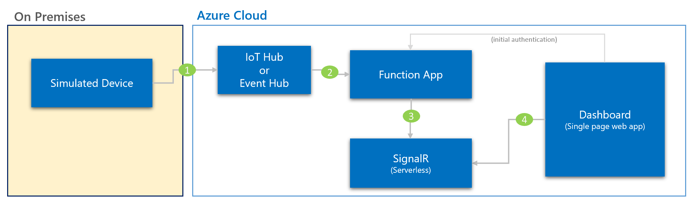

# Real time Dashboard using Azure Function and SignalR Service

### High Level Deployment Steps

#### IoT Hub
- Create a new IoT Hub Device and copy the connection string.

#### SignalR Service
- Create a new SignarlR service with ServiceMode `Serverless` and copy the connection string.

#### Function App
- Create a NodeJS Function App.
- Add following Application Settings:
    - Name: `signalr-service-connection` | Value: `<SignalR connection string>`
- Create a new Function named `negotiate` with http trigger, signalr as input and http as output.
    - See `functionapps\negotiate\function.json`
    - Update index.js code with `functionapps\negotiate\index.js`
- Create a new Function named `anomalydashboard` with IoT Hub as trigger and signalr as output. 
    - See `functionapps\anomalydasboard\function.json`
    - Update index.js code with `functionapps\anomalydasboard\index.js`

#### Simulated Device to send Realtime Messages
- Clone the repo
- Install [Nodejs](https://nodejs.org/en/)
- Goto `simulated-plc` folder in command line
- Run `npm install`
- Create `.env` file and add following variables:
    - `deviceConnectionString='<Your IoT Hub Device Connection String>'`
- Run `node .\realtime.js`

#### Realtime Dashboard Web App (running Locally)

- Open `index.html` and update the `apiBaseUrl` variable with your function app base url.
- Enable `Enable Access-Control-Allow-Credentials` and add `https://localhost:8080` in CORS Allowed Origins setting.
- Goto `real-time-dashboard\webapp` folder in command line
- Install http server `npm install http-server -g`
- Generate certificate for https `openssl req -newkey rsa:2048 -new -nodes -x509 -days 3650 -keyout key.pem -out cert.pem`
- Start http server locally `http-server -S -C cert.pem`
- Open [https://localhost:8080](https://localhost:8080)

#### Realtime Dashboard Web App (running on Azure using Static website in Azure Storage)

- Coming Soon

